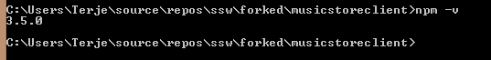

# Angular 2 - Enterprise Music Store

The MVC Music Store - but built on angular 2

**Note:** Angular 2.0 is not production ready yet! This seed project is perfect for playing around with the latest versions but do not start new projects with it since a lot of new changes are going to be introduced until the framework is officially released.

This project is based upon the awesome [Angular 2 seed project by Minko Gechev](https://github.com/mgechev/angular2-seed).
We have updated it to implement the functionality originally provided by the iconic [MVC Music Store] (http://www.asp.net/mvc/overview/older-versions/mvc-music-store/mvc-music-store-part-1).

# Quickstart

Open `PowerShell` or `CMD` and navigate to a suitable directory (e.g. `~\src`) and execute the following.

    git clone https://github.com/SSWConsulting/enterprise-musicstore-ui-angular2.git
    cd enterprise-musicstore-ui-angular2
    .\setup-environment.bat

# Detailed Building and deploying AngularMusicStore
Instructions for the developer

## Setting up the tools
Check that you have the required tools:

1.  Visual Studio 2015 Update 1
2.  ASP.Net 5
3.  Node
4.  NPM
5.  Gulp
6.  TypeScript
7.  WebEssentials - Visual Studio Extension

### Visual Studio 2015 Update 1
Download from here: [Download](http://go.microsoft.com/fwlink/?LinkId=691129) 

Ensure you install it with Python tools. 

### ASP.Net 5

Install [ASP.NET 5](https://go.microsoft.com/fwlink/?LinkId=627627)

Enable command line tools

    dnvm upgrade

See [more information](http://docs.asp.net/en/latest/getting-started/installing-on-windows.html) 

### Node
You need to upgrade nodejs to the latest version.
Download and install from [here](https://nodejs.org/en/download/)

### NPM
The npm preinstalled with VS 2015 is outdated, so it needs to be updated.
You can check the current version doing:

    npm -v

You should at least have version 3.5.0, if not, in the command prompt, run the following command to install it globally

    npm install -g  npm

The result should be something like this, but version should be at least 3.5.0:

If Bower is not present, install globally using npm:

    npm install -g bower
   
### Gulp
Then check for gulp the same way, just do:

     gulp
    
 and if no such program, again use npm to install it globally 
 
    
    npm install -g gulp
    

### Typescript
 Typescript comes with VS2015 too, but we install it globally together with the typescript definition manager.
 
     npm install -g  typescript 
     npm install tsd -g
     
### WebEssentials

Install this from the gallery, or from Visual Studio Extension dialog, link to it is [here](https://visualstudiogallery.msdn.microsoft.com/ee6e6d8c-c837-41fb-886a-6b50ae2d06a2)

### Other tools

To edit markdown files, you can use the built-in WebEssentials tool, but it doesnt really handle images (copy/pasting etc) nicely.  A much better tool is [MarkPad](http://code52.org/DownmarkerWPF/).

## Setting up the project

* git clone https://github.com/SSWConsulting/angularmusicstore  angularmusicstore
* cd angularmusicstore
*# SSW Angular Music Store
### Set up your visual studio 2015
1. Install Visual Studio 2015
2. Install nodejs 
      source: https://nodejs.org/en/. use version 4 or higher
	  reason: adds node globally so you can work with npm or tools like bower and gulp outside of Visual Studio

3. Install npm globally
        Run the following commands 
		- npm install npm -g (This is included with a generic install of node so can normally be skipped)

3. Install typescript and gulp globally so we can use them anywhere
		Run the following commands 
		- npm install typescript gulp -g

4. Install ASP.Net 5 
	follow the instructions on http://docs.asp.net/en/latest/getting-started/installing-on-windows.html
	(includes installing ASP.Net beta, dnvm setup & dnvm upgrade)

### Getting and running the code
1. Clone the project
2. Run the command `dnu restore`
3. Run `npm install` from the command line for the SSW.MusicStore.Web project
4. Run `gulp` will create a dist folder
4. Run dnx web from the command line for the SSW.MusicStore.Web project and navigate to localhost:5000/dist/app to view the site in the browser

    
    
